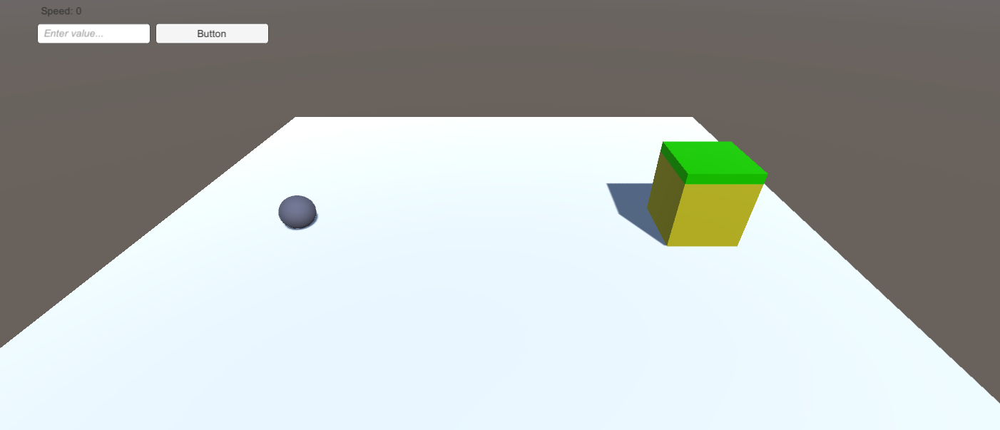
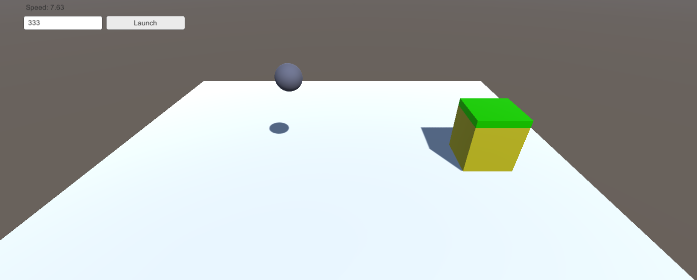

# Entry 3
##### 02/14/22

## Using Unity's User Interface

Throughout the past few weeks, I've been focusing on a specific part of my game within Unity: *User Interface (UI)*. For context, I'm making a paperball game that deals with physics. In order for the user to interact with the ball, the user types in a number (up to a three digit number) and the ball gets propelled by a force. The goal ultimately is to get the ball into the goal with the right amount of force.

There were three different UI components that I wanted to incorporate into the game.

1. UI Text Label - Displaying the speed of the ball
2. UI Field Input - Allowing the user to input a value
3. UI Button - Allowing the user to click to launch

In Unity, it provides all of these UI objects which is great. However, in order to make it functional, I had to incorporate some code. Some of the resources I've used are Unity's documention for [text](https://docs.unity3d.com/2017.3/Documentation/ScriptReference/UI.Text-text.html), [field input](https://docs.unity3d.com/530/Documentation/ScriptReference/UI.InputField-onEndEdit.html), and [button](https://docs.unity3d.com/530/Documentation/ScriptReference/UI.Button-onClick.html).

### Making the Text Label and Button

Making the text label was pretty simple. My thought process was to make the label display text on screen, which should update every frame.

```c#
void Update() // Updates every frame
{
    speedText.text = "Speed: " + rb.velocity.magnitude;
}
```

From the code above, it worked out pretty well. I just grabbed the velocity of the ball from Unity's rigidbody component and concatenated it with text.

With the button, I had to attach the `onClick` event with a function

```c#
public void launchBall()
{
    rb.AddForce(Vector3.up * speed);
    rb.AddForce(Vector3.right * speed);
}
```

This simply added the forces to propell the ball forward when the button was pressed.

### Making the Field Input (Big Challenge)

Incorporating the field input was one of the biggest challenges I've encountered with UI. It worked a little differently than text labels. Initially, I thought that I would be able to grab the value of field input by using similar syntax.

Ex: `int userNum = fieldInput.text; // Didn't work`

Instead, I've realized that Field Inputs in Unity had a method attached to it called `On End Edit (String)`. Basically, in simple terms, once the user clicks out of the input, the text is passed into the parameter. I can then take this value and store it in a variable.

```c#
public void getInput(string userInput)
{
    fieldInput = userInput;
}
```

However, this led to a problem. This meant that only strings could be recieved (This was a problem because I needed it to be recieved as an integer. I would then be able to use the integer as the force of the ball).

In order to solve this, I found an [article](https://www.tutorialsteacher.com/articles/convert-string-to-int#:~:text=The%20TryParse()%20methods%20are,64%2Dbit%20signed%20integer%20equivalent.) that helped me with converting the two datatypes (String -> int)


``` c#
// Top of script
Using System;

// within getInput(string userInput)
userNum = Int16.Parse(userInput); // Essentially converts the string userInput into an integer (ex: "123" -> 123)
```

With this, I was able to store the `userInput`, a string, into `userNum`, an int. This value was later used as the force of the upward and right motion of the object.

### Result
Screenshot 1:


*image capturing before ball was launched*

Screenshot 2:


*image capturing after ball was launched*

### Next Steps

I plan to polish this out more in the future. Other than making it look better, I'm thinking of separating the upward and rightward forces. In addition, after I've gotten the fundamentals to work, I'll begin working on multiple stages (more levels) of the game.

### EDP & Skills

In the Engineering Design Process, I'm currently at **Creating the prototype**. I've been learning my tool especially focusing on the content that I'll be using to build my game. Although, it's been at a basic level (basic-models and UI), it's been mainly functional. I've used Unity's basic models (primitives like cubes, spheres, and planes) and a basic knowledge of C# to build a functional game. In terms of what I plan to continue, I want to finish creating the game in the next month. After that, I'll plan to polish the game by making it look more appealing to the player (hopefully using Blender).

In the past few weeks, I've learned _*to read*_ and _*to have a growth mindset*_. Especially with the documentations and articles on code, I've learned to extract important information and write down what's essential for my game. I also had went through some challenges when dealing with the UI. However, I've learned to embrace through the failure and learn through these mistakes. I will continue to learn C# and hopefully work efficiently towards my MVP.


[Previous](entry02.md) | [Next](entry04.md)

[Home](../README.md)