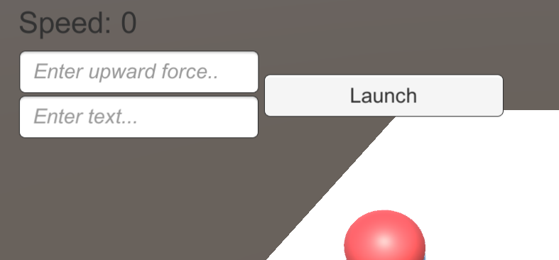
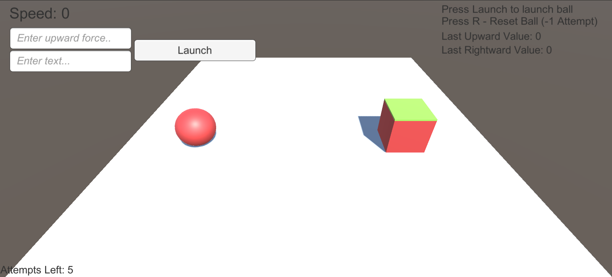
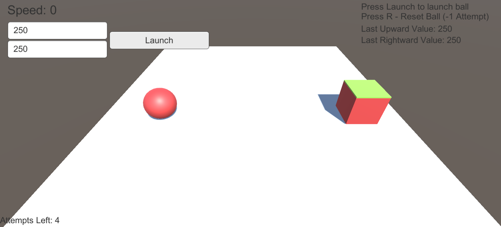

# Entry 4
##### 3/22/22

### Finish Creating a Scene in Unity

In Unity, there can be multiple scenes which are typically used to create multiple worlds. In my case, I can use scenes to create multiple levels of my Physics Paper-ball Game. The past few weeks, I've been working on completing the functionality of my game of ONE scene by making sure the game is intended to work.

#### Finalizing UI Elements

I have added two different input field for the user. Each input field correlates to either the upward or rightward force.


Coding its functionality was relatively simple since I've already created a field input discussed in my last blog entry. I created a second function that handled the upward force.

In addition, I added more information in the UI, including a guide-related text-box to teach the user about the game. This includes telling the basic controls, their last inputs, and how many attempts are left before failure. After adding all of the UI elements, I watched a [YouTube Tutorial](https://www.youtube.com/watch?v=w3sMD-3OJro) on UI Anchors in order to learn about UI positioning in Unity.


#### Adding Randomization

In my game, I wanted the bucket (goal) to always change position if the user fails to meet the goal within 5 attempts. This meant that would always be a change in position so that the game could always be replayed with different values.

Luckily, Unity has a Random.Range method that returns a random value. Using Unity's [documentation](https://docs.unity3d.com/ScriptReference/Random.Range.html), I created this:

```c#
private float RandomizePosition()
{
    float bucketPos = 3;
    float x = UnityEngine.Random.Range(-1f, 1f);

    return (bucketPos + x);
}
```
The code above is a method I created in order to randomize a value from its initial position, 3, and change it's value from the interval by 1, which leads to the possible interval of [2, 4].


```c#
if(attempts == 0)
    {
        float pos = RandomizePosition();
        bucket.transform.position = new Vector3(pos, bucket.transform.position.y, bucket.transform.position.z);
        hitDetect.transform.position = new Vector3(pos, hitDetect.transform.position.y, hitDetect.transform.position.z);

        attempts = 5;
        attemptsText.text = "Attempts Left: 5";
    }

```

The code above utilizes the RandomizePosition method that I created. In short, it runs the method whenever the player runs out of attempts.

Example of Randomization:




Notice the shift of the cube (it shifts to the right).

### Engineering Design Process and Skills
In the **Engineering Design Process**, I'm finishing *testing the prototype* and moving onto *improving as needed*. In terms of functionality, everything that is intended to be in the game is there. In the future, I would need to work on finalizing the position of the UI and adding additional content (i.e. more stages).

The skills I have learned within the past few weeks are **Consideration** and **Attention to detail**. I've definitely utilized these skills in order to create a better game for the audience but also for the purpose to make the game more appealing.

1. I've **considered** implementing different UI in order to make the game understood by the player. It should be easy for the player to understand the objective and aware of their obstacles. I've added lives which would be more of an obstacle to their goal of shooting the ball into a bucket. In addition, I've added randomization into the game which is intended to make the game more dynamic.

2. I've also learned to be **attentive to details**. Obviously, in a 3-Dimensional Game, I would want the models to represent how its intended to look. Although


### Next Steps

[Previous](entry03.md) | [Next](entry05.md)

[Home](../README.md)