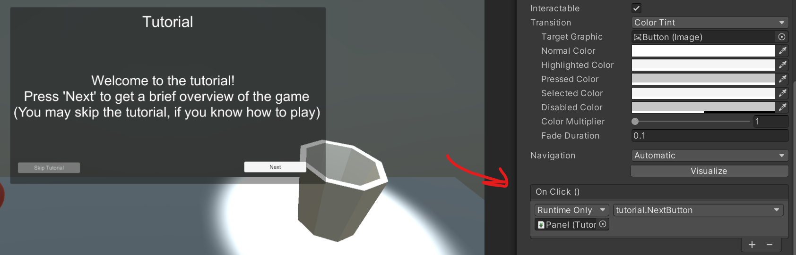
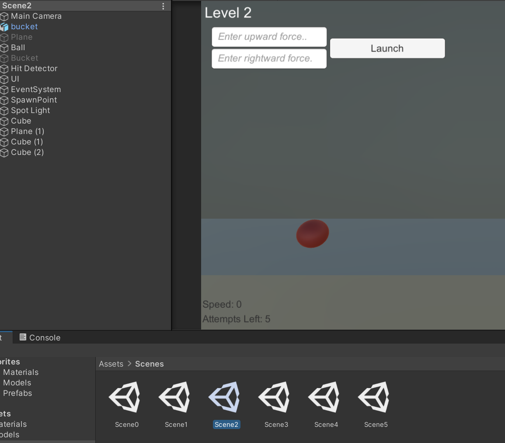

# Entry 5
##### 4/27/22

### Final Implementations

As the deadline for the MVP approached, I've finished adding features that I found were necessary for my physics-ball game made with Unity.

Some new features I had added:

* Tutorial (Through UI / Text)
* More Levels (Obstacles)
* Layout Change (Incl. Magnitude of Distance UI)

I was able to create these features by exploring

1. UI Panels
2. Unity's Scene Management

When making the tutorial, I thought of making a UI where it allows the user to see a series of steps. To do this, I created a panel where it would change the text everytime they press the 'Next' Button.

```c#
public void NextButton()
    {
        step++;
        if (step == 1)
        {
            text.text = "The goal of this game is to get the red ball ...";
        } else if (step == 2)
        {
            text.text = "Some general controls and statistics ...";
        } else if (step == 3)
        ...
```

I've attached the method above as the runner for the `onClick` event listener. I took a different approach to make the onClick listener work. I created the method above and attached it as a GameObject as a simplied way. You can view the approach I took [here](https://answers.unity.com/questions/942622/how-do-you-call-a-function-with-a-button-unity-5-u.html).




As I mentioned earlier, I've made several new levels to the game. In order for my game to switch to these levels. I had to explore *Scene Management*. After reading more of Unity's [documentations](https://docs.unity3d.com/ScriptReference/SceneManagement.SceneManager.html) on Scene Management, I was able to change the scenes based on name.

Some important takeaways from that doc were
* `SceneManager.GetActiveScene()` - Grab the current scene (Allows the code to read / get scene name)  
* `SceneManager.LoadScene("scene-name")` - Switch to scene by name.




### Engineering Design Process

In the Engineering Design Process, I'm currently at *improving the prototype as needed*. Although everything in my game is working and functional, there are still a few places where I can improve. Such as importing models to make the game look more established and aesthetically pleasing, as well as fixing any bugs that potentially arise.

Afterwards, I'll be ready to *communicate the results* of my protocol.

### Skills

In terms of skills, I've learned to improve my *time management*, especially through creating the MVP plan and sticking with it. It helps with establishing deadlines for myself and being ready to finish a task by that deadline. That definitely helped with the way I handled a deadline, making me more disciplined in a way. This also connects with the other skill of *organization*. By setting an organized plan, I was able to follow through a plan that was easy for me to follow, but at the same time, it also kept me knowing what's my next steps and goals that I need to meet.

[Previous](entry04.md) | [Next](entry06.md)

[Home](../README.md)